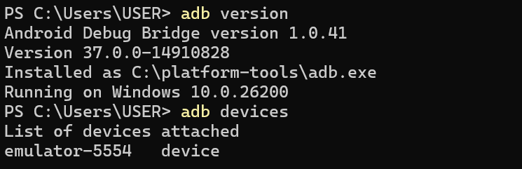
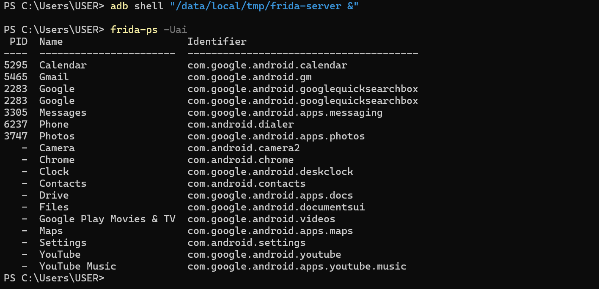
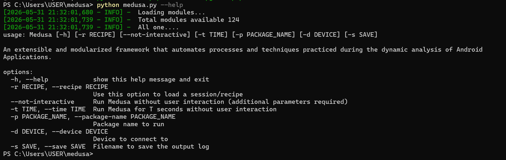
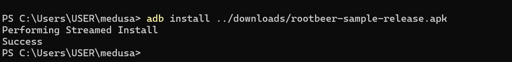
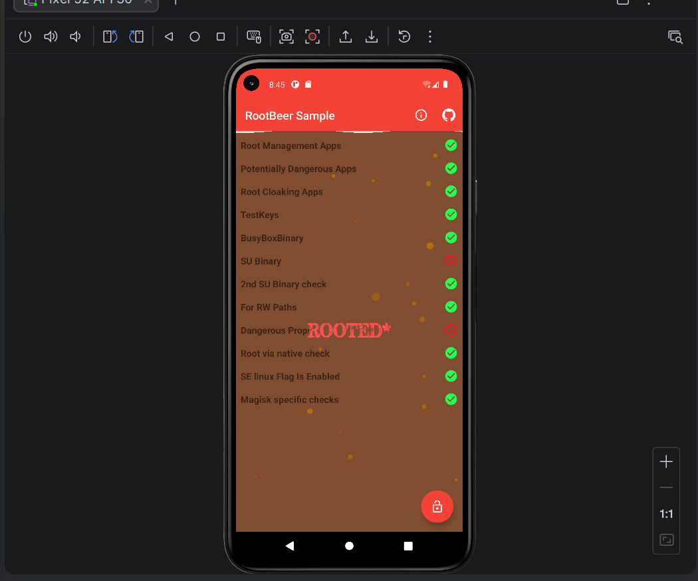
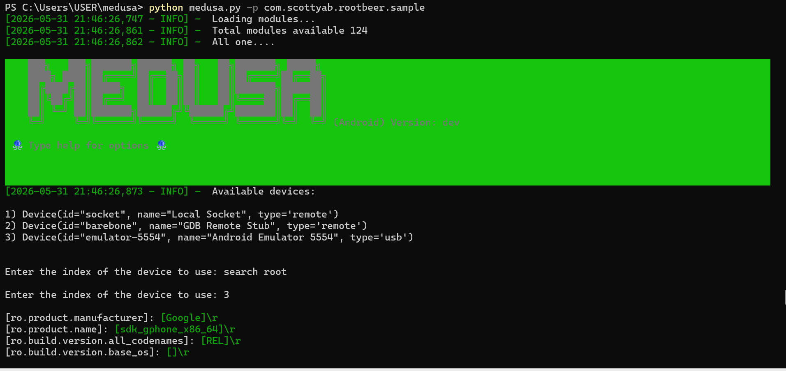
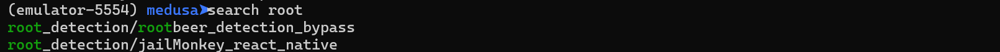
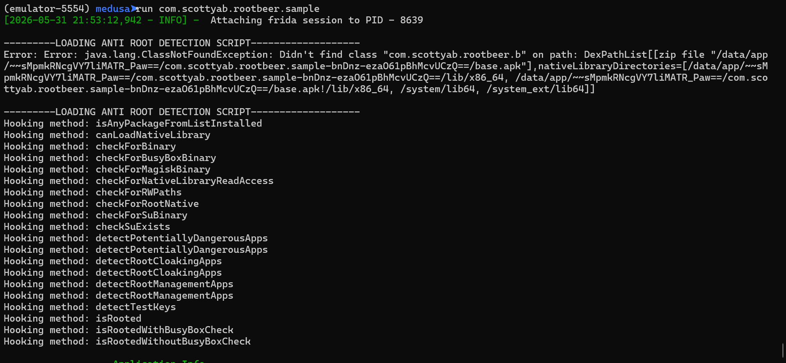
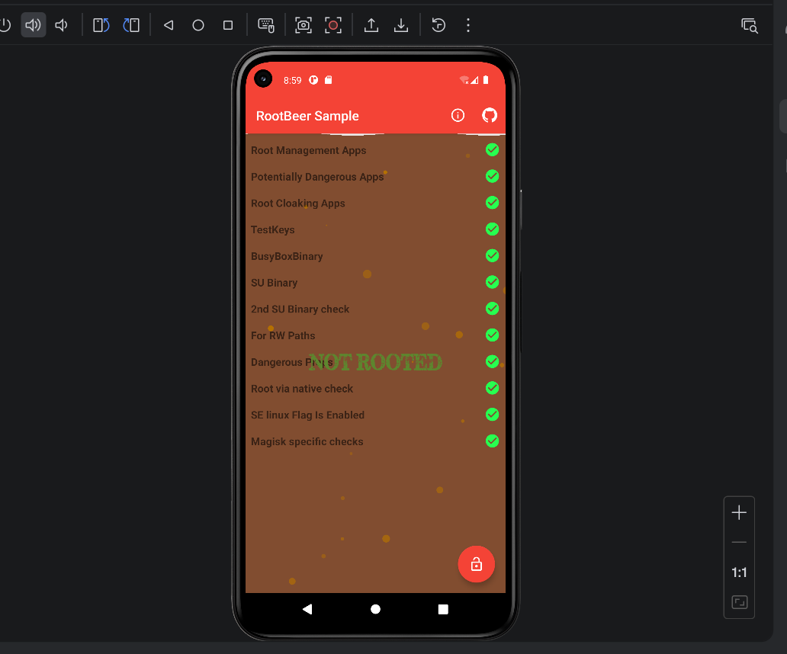

# LAB 12 — Bypass de la Détection de Root Android avec Medusa
**Cours : Sécurité des applications mobiles**
**Étudiante : CHAIMAA ELGADAOUI**

---

## Objectifs
- Réaliser un bypass de la détection de root Android en utilisant **Medusa** (framework d'instrumentation basé sur Frida)
- Comprendre les mécanismes de détection de root utilisés par les applications Android
- Valider que l'application cible ne détecte plus le root après le bypass
- Usage éthique : ces techniques sont appliquées uniquement sur des apps/appareils autorisés dans le cadre pédagogique

## Étape 1 — Préparation de l'environnement Android et Frida

### Versions installées
| Outil | Version |
|---|---|
| Python | 3.11.9 |
| pip | 24.0 |
| frida (PC) | 17.9.11 |
| frida-tools | 14.8.2 |
| ADB | 37.0.0-14910828 |

### Émulateur utilisé
- **Modèle** : Pixel 52
- **Android** : 11.0 (API 30)
- **Architecture** : x86_64

### Vérification ADB
```bash
adb version
# Android Debug Bridge version 1.0.41
# Version 37.0.0-14910828

adb devices
# emulator-5554   device
```


### Déploiement de frida-server
```bash
# Identification de l'architecture
adb shell getprop ro.product.cpu.abi
# x86_64

# Transfert du binaire
adb push C:\Users\USER\Downloads\frida-server /data/local/tmp/
# 1 file pushed — 110 837 320 bytes en 14.4s

# Permissions et démarrage en root
adb shell chmod 755 /data/local/tmp/frida-server
adb root
adb shell "/data/local/tmp/frida-server &"

# Vérification — liste des processus visibles par Frida
frida-ps -Uai
```


### Résultat frida-ps -Uai (extrait)
| PID | Name | Identifier |
|---|---|---|
| 5295 | Calendar | com.google.android.calendar |
| 5465 | Gmail | com.google.android.gm |
| 2283 | Google | com.google.android.googlequicksearchbox |
| 3305 | Messages | com.google.android.apps.messaging |
| 6237 | Phone | com.android.dialer |
| 3747 | Photos | com.google.android.apps.photos |
| – | Settings | com.android.settings |
| – | YouTube | com.google.youtube |

**frida-server opérationnel sur l'émulateur.**
## Étape 2 — Installation de Medusa

### Clonage du dépôt
```bash
git clone https://github.com/Ch0pin/medusa.git
cd medusa
pip install -r requirements.txt
```

### Vérification de l'installation
```bash
python medusa.py --help
```

### Résultat


## Étape 3 — Détection de root (état AVANT bypass)

### Installation de l'app cible
```bash
adb install ../downloads/rootbeer-sample-release.apk
# Performing Streamed Install
# Success
```



### État AVANT bypass — RootBeer détecte le root

| Check | Résultat |
|---|---|
| Root Management Apps | Passed |
| Potentially Dangerous Apps | Passed |
| Root Cloaking Apps | Passed |
| TestKeys |  Passed |
| BusyBoxBinary | Passed |
| SU Binary | **Détecté** |
| 2nd SU Binary check | Passed |
| For RW Paths | Passed |
| Dangerous Props | **Détecté** |
| Root via native check | Passed |
| SE Linux Flag Is Enabled | Passed |
| Magisk specific checks | Passed |

### Verdict : ROOTED*



> L'application détecte la présence de root via deux vecteurs :
> **SU Binary** et **Dangerous Props**.
> L'objectif du bypass est de neutraliser ces deux détections.

## Étape 4 — Lancer Medusa avec le module root bypass

### Lancement de Medusa
```bash
python medusa.py -p com.scottyab.rootbeer.sample
# Sélection du device : 3 (emulator-5554)
```



### Recherche du module root bypass




### Activation du module
```
(emulator-5554) medusa➤use root_detection/rootbeer_detection_bypass
Current Mods:
0) root_detection/rootbeer_detection_bypass

(emulator-5554) medusa➤startserver
[INFO] - Listening at 127.0.0.1:1711

(emulator-5554) medusa➤run com.scottyab.rootbeer.sample
[INFO] - Attaching frida session to PID - 8639
```

### Hooks installés par Medusa
```
Hooking method: isAnyPackageFromListInstalled
Hooking method: canLoadNativeLibrary
Hooking method: checkForBinary
Hooking method: checkForBusyBoxBinary
Hooking method: checkForMagiskBinary
Hooking method: checkForNativeLibraryReadAccess
Hooking method: checkForRWPaths
Hooking method: checkForRootNative
Hooking method: checkForSuBinary
Hooking method: checkSuExists
Hooking method: detectPotentiallyDangerousApps
Hooking method: detectRootCloakingApps
Hooking method: detectRootManagementApps
Hooking method: detectTestKeys
Hooking method: isRooted
Hooking method: isRootedWithBusyBoxCheck
Hooking method: isRootedWithoutBusyBoxCheck
```



---

## Étape 5 — Validation du bypass

### Verdict AVANT : 🔴 ROOTED*


### Verdict APRÈS : 🟢 NOT ROOTED


**Bypass complet — 12/12 checks passés au vert.**
> Medusa a intercepté et neutralisé toutes les méthodes de détection
> de root de RootBeer via 17 hooks Frida injectés dynamiquement.
